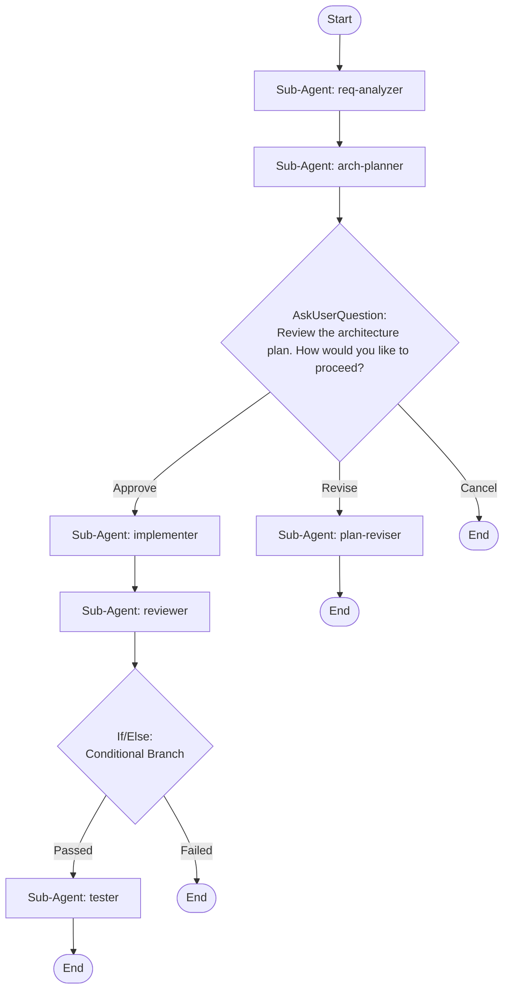

## Workflow Execution Guide

Follow the Mermaid flowchart above to execute the workflow. Each node type has specific execution methods as described below.

### Execution Methods by Node Type

- **Rectangle nodes (Sub-Agent: ...)**: Execute Sub-Agents
- **Diamond nodes (AskUserQuestion:...)**: Use the AskUserQuestion tool to prompt the user and branch based on their response
- **Diamond nodes (Branch/Switch:...)**: Automatically branch based on the results of previous processing (see details section)
- **Rectangle nodes (Prompt nodes)**: Execute the prompts described in the details section below

## Sub-Agent Node Details

#### req_analyzer(Sub-Agent: req-analyzer)

**Description**: Analyze project requirements

**Model**: sonnet

**Prompt**:

```
You are a requirements analyst. Analyze the project requirements provided by the user or gathered from the codebase context.

1. Identify functional requirements (what the system should do)
2. Identify non-functional requirements (performance, security, scalability)
3. Define acceptance criteria for each requirement
4. Identify dependencies and constraints
5. Estimate complexity (low/medium/high) for each requirement

Output a structured requirements document with clear, testable criteria.
```

#### arch_planner(Sub-Agent: arch-planner)

**Description**: Design system architecture and implementation plan

**Model**: opus

**Prompt**:

```
You are a software architect. Based on the requirements analysis, design the system architecture and create an implementation plan.

1. Define the high-level architecture (components, services, data flow)
2. Choose appropriate design patterns and technologies
3. Create a file-by-file implementation plan
4. Identify potential risks and mitigation strategies
5. Define the testing strategy
6. Break down the work into ordered implementation steps

Output a detailed architecture document and step-by-step implementation plan.
```

#### implementer(Sub-Agent: implementer)

**Description**: Implement code based on the approved plan

**Model**: sonnet

**Prompt**:

```
You are a senior software developer. Implement the code based on the approved architecture plan.

1. Follow the implementation plan step by step
2. Write clean, well-structured, production-ready code
3. Follow existing project conventions and patterns
4. Add appropriate error handling and input validation
5. Write code that is testable and maintainable
6. Create or update necessary configuration files

Implement all changes as specified in the plan. Do not leave TODOs or placeholder code.
```

#### plan_reviser(Sub-Agent: plan-reviser)

**Description**: Revise the architecture plan based on feedback

**Model**: opus

**Prompt**:

```
You are a software architect. The user has requested revisions to the architecture plan.

1. Review the current plan and identify areas needing improvement
2. Ask the user for specific feedback on what needs to change
3. Incorporate feedback into a revised architecture and implementation plan
4. Ensure the revised plan addresses all concerns raised
5. Output the updated plan clearly highlighting what changed

Provide the revised plan for re-approval.
```

#### reviewer(Sub-Agent: reviewer)

**Description**: Review implemented code for quality and issues

**Model**: opus

**Prompt**:

```
You are a senior code reviewer. Thoroughly review all code changes made during implementation.

1. Check code quality, readability, and maintainability
2. Verify adherence to project conventions and best practices
3. Identify potential bugs, edge cases, and error handling gaps
4. Check for security vulnerabilities (OWASP top 10)
5. Verify the implementation matches the architecture plan
6. Check for performance issues and optimization opportunities

Provide a detailed review with severity ratings: critical, major, minor, suggestion.
Conclude with a clear PASS or FAIL verdict.
```

#### tester(Sub-Agent: tester)

**Description**: Run tests and validate the implementation

**Model**: sonnet

**Prompt**:

```
You are a QA engineer. Validate the implementation through comprehensive testing.

1. Run existing test suites and verify they pass
2. Write new tests for the implemented features
3. Verify acceptance criteria from requirements are met
4. Test edge cases and error scenarios
5. Check integration points with existing code
6. Summarize test results with pass/fail counts and coverage

Provide a complete test report with results and any remaining concerns.
```

### AskUserQuestion Node Details

Ask the user and proceed based on their choice.

#### ask_approve(Review the architecture plan. How would you like to proceed?)

**Selection mode:** Single Select (branches based on the selected option)

**Options:**
- **Approve**: Plan looks good, proceed to implementation
- **Revise**: Plan needs changes, revise before continuing
- **Cancel**: Cancel the project development flow

### If/Else Node Details

#### review_check(Binary Branch (True/False))

**Evaluation Target**: Code review verdict from the reviewer agent

**Branch conditions:**
- **Passed**: Code review passed with no critical or major issues
- **Failed**: Code review found critical or major issues requiring fixes

**Execution method**: Evaluate the results of the previous processing and automatically select the appropriate branch based on the conditions above.
